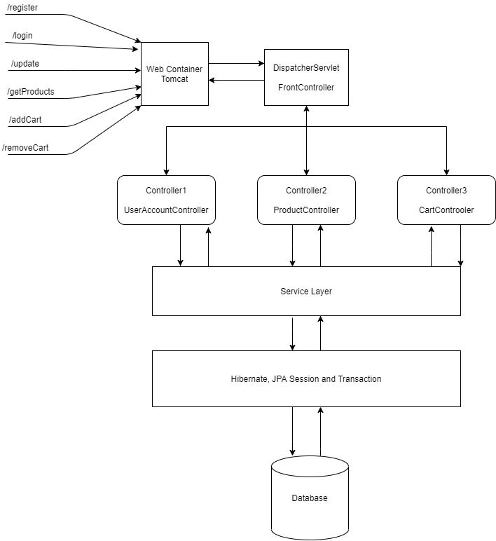
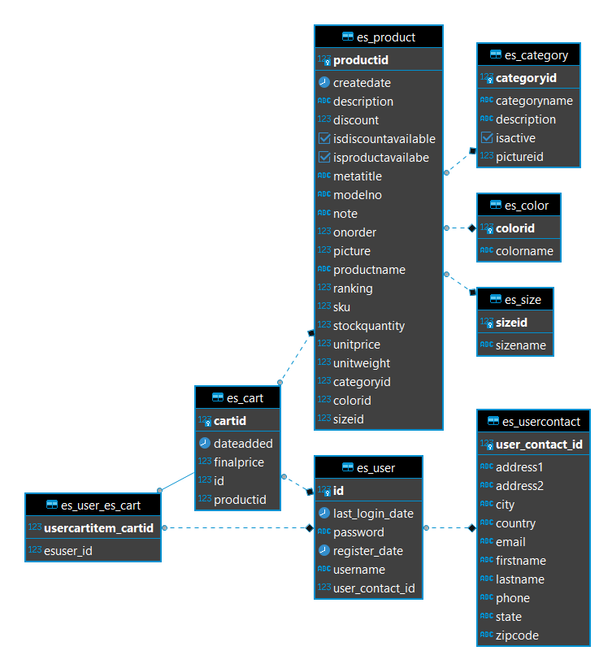

# EasyShop-Backend

## Executive Summary

EasyShop is an ecommerce platform where users can browse products which oranize by catagories, and add them to a virtual cart through their user account. The extend functionalities for the app will be purchasing and searching for their shopping stuff.
This project is a Maven program that can run on a server and support the end point for the EasyShop-Frontend. Base on the client request, this backend server will interact with customer database by using object realtion mapping, Hibernate to process the regiseter, login, adding items to cart, view carts and also purchse for their project.

## Technologies / Dependencies

- Maven build automation tool
- JDBC and Postgres database
- Servlet and Tomcat server
- Web: HTML, CSS, Bootstrap, JavaScript, Fetch API
- Version Control Github
- Jenkins pipline
- Remote cloud database with Amazon RDS
- Virtual machine with Amazon EC2
- Host static website with Amazon S3

## Features

1. Constructing an End point for create User Account by using Postman
2. Encrypted password before storing in database
3. Functionality for User login to account from website
4. Session is stored for User credential after login
5. Ability for Employee Account can submit a reimbursment or view them all.
6. Ability for Manager Account can view all reimbursments
7. Ability for Manager can filter past or pending reimbursments
8. Ability for Manager can apporve or deny a pending reimbursment

## Strech Goals:

- Replace JDBC with Hibernate to manage the database connection.
- Users can upload a document or image of their receipt when submitting reimbursements which can stored in the database and reviewed by a financial manager.
- Using Angular for Frontend

**Engineering Diagram**

## Getting Started

1. Clone the project to your local machine and open it with a JDK
2. Install a Postgres database in local or remoted host(RDS)
3. Config database connecion url, username and password in package: com.revature.ers.utilities
4. Create database following:

**ER Diagram**

5. Maven Update to build dependencies
6. Install Tomcat on running enviroment
7. Run Maven project on Tomcat server

## Usage

- Run EasyShop frontend for using the application. Information can find from the link:
  [https://github.com/htl43/EasyShop-Frontend](https://github.com/htl43/EasyShop-Frontend)

## License

MIT
